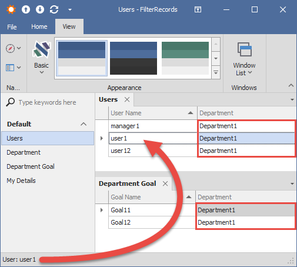

<!-- default badges list -->
[](https://supportcenter.devexpress.com/ticket/details/E4045)
[](https://docs.devexpress.com/GeneralInformation/403183)
<!-- default badges end -->
# How to restrict inter-departmental data access using Security Permissions (EF Core)

## Scenario

This example demonstrates how to use [XAF's Security System](https://docs.devexpress.com/eXpressAppFramework/113366/concepts/security-system) to implement the following access control/authorization requirements:

- User Role (users: **user1, user12, user2, user22**) - read-only access to their own Department, corresponding Department Goals, an Employee list in that department, and Tasks assigned to these Employees.

  

- Manager Role (users: **manager1, manager2**) - read-write access to their own Department, corresponding Department Goals, Employee list, and their Tasks. Managers can link or unlink existing entities. 

  

- Administrator Role (users: **Admin**) - full access to all entities in the application. Administrators can create new entities. 

  

You can login as any user. Type in a user name and an empty password. 

## Implementation Steps
1. In the *SolutionName.Module/DatabaseUpdate/Updater* file, configure [security permissions](https://docs.devexpress.com/eXpressAppFramework/113366/concepts/security-system/security-system-overview) at the type, object and member level (with a criteria). To build complex criteria against associated objects, use the [ContainsOperator](https://docs.devexpress.com/CoreLibraries/DevExpress.Data.Filtering.ContainsOperator) together with the built-in `CurrentUserId` and `IsCurrentUserInRole` [criteria functions](http://documentation.devexpress.com/#xaf/CustomDocument3307).
2. In the *SolutionName.Module/BusinessObjects* folder, implement the `Department`, `DepartmentGoal` and `EmployeeTask` business classes ([class diagram](./media/ClassStructure.png).).
3. Set the following settings in the `builder.Security.UseIntegratedMode()` method call: 
    ```cs
    options.Events.OnSecurityStrategyCreated = securityStrategy => {
        ((SecurityStrategy)securityStrategy).AssociationPermissionsMode = 
          AssociationPermissionsMode.Manual;
    };
    options.RoleType = typeof(PermissionPolicyRole);
    options.UserType = typeof(FilterRecords.Module.BusinessObjects.ApplicationUser);
    options.UserLoginInfoType = 
      typeof(FilterRecords.Module.BusinessObjects.ApplicationUserLoginInfo);
    ```

      For complete implementation, review the following files: [ApplicationBuilder.cs](.CS/FilterRecords.Win/ApplicationBuilder.cs) (WinForms module) and [Startup.cs](.CS/FilterRecords.Blazor.Server/Startup.cs) (Blazor module).

4. In the *SolutionName.Module/Controllers* folder, optionally implement a Controller to hide the protected content columns in a List View and Property Editors in a Detail View. For more information, see [this help topic](https://docs.devexpress.com/eXpressAppFramework/114008/task-based-help/security/how-to-hide-the-protected-content-columns-in-a-list-view-and-property-editors-in-a-detail-view).
