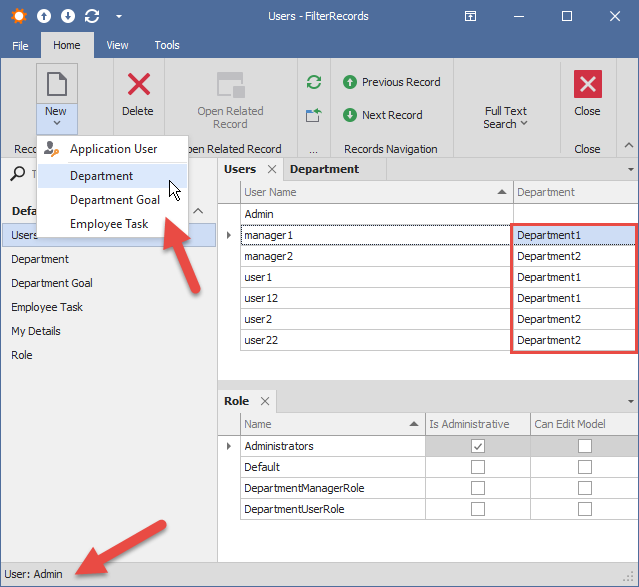

<!-- default badges list -->

<!-- default badges end -->
# How to separate employees data in different departments using security permissions in XPO

## Scenario

This example demonstrates how to use [XAF's security system](https://docs.devexpress.com/eXpressAppFramework/113366/concepts/security-system) to implement the following access control/authorization requirements:
- Users Role (users: **Joe, John**) can view and edit tasks from their own department, but cannot delete or create tasks. Users also have readonly access to employees and other data of their own department.

  

- Managers Role (users: **Sam, Mary**) can fully manage (CRUD) their own department, its employees and tasks. Managers cannot access data from other departments.

  

- Administrators Role (users: **Admin**) can do everything within the application.

  

All users have empty passwords by default. [Functional tests](https://docs.devexpress.com/eXpressAppFramework/113211/concepts/debugging-testing-and-error-handling/functional-tests-easy-test) for these scenarios are in the *SolutionName.EasyTests* folder.

## Implementation Steps
1. In the *SolutionName.Module/DatabaseUpdate/Updater* file, configure [security permissions](https://docs.devexpress.com/eXpressAppFramework/113366/concepts/security-system/security-system-overview) at the type, object and member level (with a criteria). To build complex criteria against associated objects, use the [ContainsOperator](https://docs.devexpress.com/CoreLibraries/DevExpress.Data.Filtering.ContainsOperator) together with the built-in `CurrentUserId` and `IsCurrentUserInRole` [criteria functions](http://documentation.devexpress.com/#xaf/CustomDocument3307).
2. In the *SolutionName.XXX/XXXApplication* file, use the [SecuredObjectSpaceProvider](https://docs.devexpress.com/eXpressAppFramework/113437/task-based-help/security/how-to-change-the-client-side-security-mode-from-ui-level-to-integrated-in-xpo-applications) in the `CreateDefaultObjectSpaceProvider`method of the `XafApplication` descendants.
3. In the *SolutionName.Module/BusinessObjects* folder, implement the `Department`, `DepartmentGoal` and `EmployeeTask` business classes ([class diagram](./media/ClassStructure.png).).
4. In the *SolutionName.XXX/XXXApplication.Designer* file, set the `this.securityStrategyComplex1.UserType` and `this.securityModule1.UserType` properties to the `Employee` type and set the `this.securityStrategyComplex1.AssociationPermissionsMode` property to DevExpress.ExpressApp.Security.AssociationPermissionsMode.Manual. For more information, see [this help topic](https://docs.devexpress.com/eXpressAppFramework/DevExpress.ExpressApp.Security.SecurityStrategy.AssociationPermissionsMode).
5. In the *SolutionName.Module/Controllers* folder, optionally implement a Controller to hide the protected content columns in a List View and Property Editors in a Detail View. For more information, see [this help topic](https://docs.devexpress.com/eXpressAppFramework/114008/task-based-help/security/how-to-hide-the-protected-content-columns-in-a-list-view-and-property-editors-in-a-detail-view).
